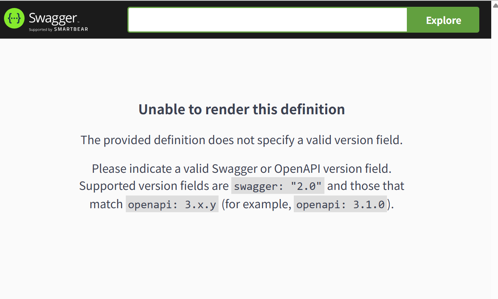

# TIL
## WebSecurityCustomizer와 SecurityFilterChain 차이
## SecurityChain 이란?
`SecurityFilterChain is used by FilterChainProxy to determine which Spring Security Filter instances should be invoked for the current request.`
: SecurityFilterChain은 어떤 스프링시큐리티필터 인스턴스가 현재 요청이 호출되어야하는지를 결정하기위해 필터체인프록시에 의해 이용됨.
## FilterChainProxy란?


## SecurityFIlterchain과 Swagger 접근 관련 오류[문제해결]

1. 다른 블로그에서 검색결과 최신 버전 업데이트하라고 나왔으나, 이미 최신버전임
2. 그렇다면 SwaggerConfiguration 설정파일 오류일 확률이높았음.
3. 문제해결
   - GPT 한테 물어본 결과 open-api 버전이 1.X.X->2.X.X으로 변경되면서 uri 가 변경됨
   - 따라서 잘못된 uri를 필터체인에 등록시켜서 필터체인이 정작 통과 시켜야할 uri를 통과 시키지 않음
   - 변경전 (아래 uri는 1.X.X 버전의 uri)
     
   - 변경 후
     
## Swagger 관련 코드 오류 [문제해결]
- 문제상황: Swagger 에서 api 테스트를 하려고 하는데 자꾸 거부됨. 로그를 살펴보니 String type의 id를 찾을 수 없다고 뜸.
- 해결방법: 구글링 결과 , @RequestParam은 기본적으로 url 상에서 데이터를 찾는다고 나와있음. 즉 url상의 param과 내가 코드에 정의해놓은 매개졈수가 일치하지 않아서 찾지 못한것으로 추측해 swagger에서 실행한 코드를 다시 살펴본 결과 swagger에서 요청한 url Param은 id가 아닌 ID로 되어있었음. 따라서 `@Parameter`name을 매개변수와 일치하게 설정한 결과 오류 해결됨.
- 


## jwt 토큰 인증 관련 오류[문제해결]
- 문제상황: 로그인을 진행하려고 하니까 `javax/xml/bind/DatatypeConverter ` 오류가 뜸
- 해결방법: 구글링 결과 jwt 토큰 인증 관련한 오류이며, 몇가지 의존성을 추가하지않아서 벌어진일. 따라서, 구글링 했던 블로그에서 시킨대로 의존성 추가하여 해결함.
```java
//pom.xml에 추가
    <dependency>
        <groupId>io.jsonwebtoken</groupId>
        <artifactId>jjwt</artifactId>
        <version>0.9.1</version>
    </dependency>
    <dependency>
        <groupId>com.sun.xml.bind</groupId>
        <artifactId>jaxb-impl</artifactId>
        <version>4.0.1</version>
    </dependency>
    <dependency>
        <groupId>com.sun.xml.bind</groupId>
        <artifactId>jaxb-core</artifactId>
        <version>4.0.1</version>
    </dependency>
    <dependency>
        <groupId>javax.xml.bind</groupId>
        <artifactId>jaxb-api</artifactId>
        <version>2.4.0-b180830.0359</version>
    </dependency>
```