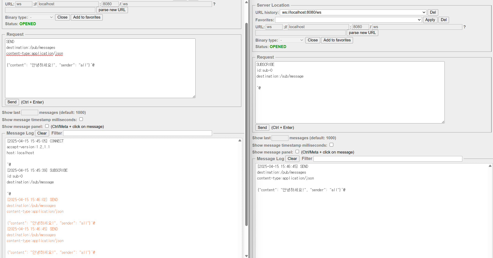

# TIL
- 웹소켓 연결 테스트 성공함

- 여기서 발생되는 궁금한점
  1. 나는 일반 웹소켓이랑 stomp를 둘다 설정하고 끝에 엔드포인트를 다르게 설정했는데(일반 ws,stomp:ws-stomp), ws로만 되고 stomp 엔드포인트로 보내니까 연결을 거부한다. 이유를 모르겠다.
     - 가설 1: stomp를 연결하기 위해서는 일반 websocket설정을 지워야함.
     - 가설 2: 그외의 설정이 잘못됬다던가...? -> security 설정..?(했음)
- 참고했던 자료들
  - [build.gralde에 설치해야하는 의존성 관련](https://kje1218.tistory.com/18)
  - [웹소켓 정의 관련](https://velog.io/@sj_yun/Web-Socket%EC%9D%B4%EB%9E%80)
- 오늘 수업시간에 해야할것
- [ ] 텍스트 보내면 처리기능
- [ ] 유저 아이디 랜덤 부여기능
- [ ] 마이페이지에서 아이디 등 수정 기능